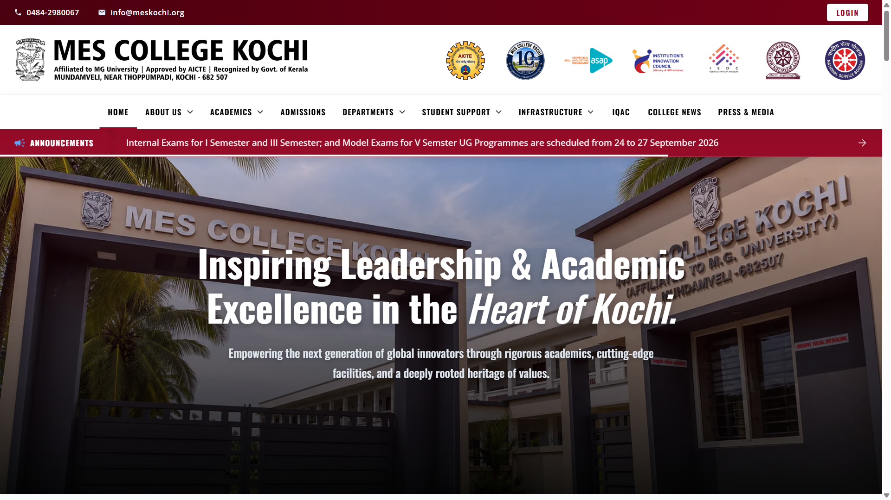
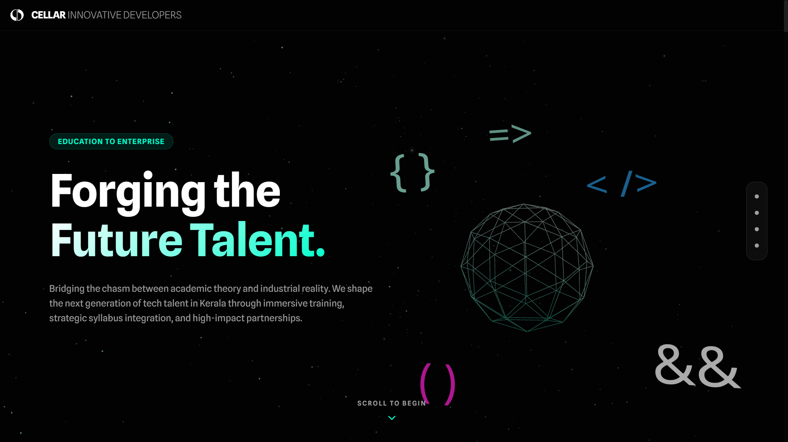
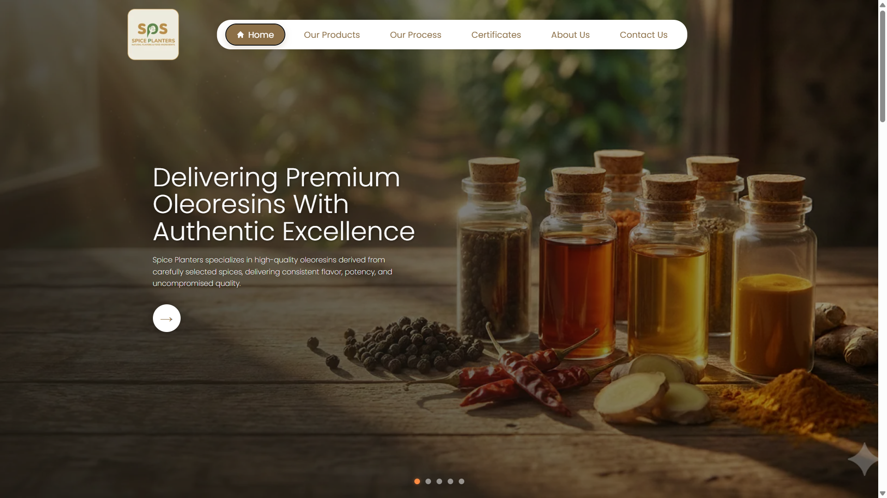
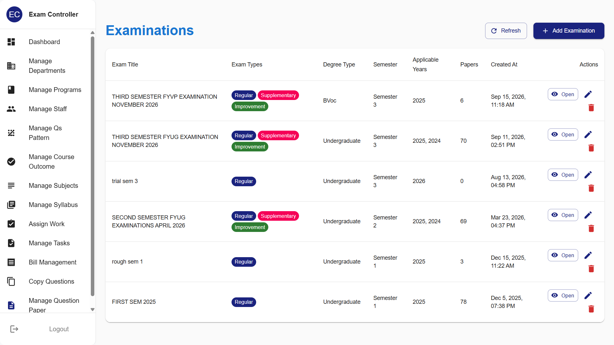

# Naseef

### Full Stack & Mobile Developer

**MSc in Artificial Intelligence** &nbsp;·&nbsp; **3+ Years of Industry Experience**

Building scalable web applications, mobile apps and enterprise ERP systems, from UI to database to deployment.

 

 

---

## About

I'm a full stack developer who builds real products for real organizations: college websites, corporate sites, an examination platform and a multi-module college ERP.

I own features end to end: **requirements → React frontend → Node.js APIs → database → deployment**. With an MSc in AI, I'm also interested in bringing intelligent features into everyday business software.

 

---

## Featured Projects

<table>
<tr>
<td width="50%" valign="top">

### MES College Kochi
Institutional website with dynamic content management for news, events and academic information.

`React` `Node.js` `Express` `MySQL`

**[Live Site →](https://mescollegekochi.ac.in/)**

</td>
<td width="50%" valign="top">

### Cellar Innovative Developers
Immersive 3D interactive corporate website with a professional web presence.

`React` `JavaScript` `3D Web`

**[Live Site →](https://www.cellarinnovative.dev/)**

</td>
</tr>
<tr>
<td width="50%" valign="top">

### Spice Planters
Responsive corporate website with structured content and backend APIs.

`React` `JavaScript` `CSS` `REST APIs`

**[Live Site →](https://www.spiceplanters.com/)**

</td>
<td width="50%" valign="top">

### QP Solution
Question bank management and question paper generation for autonomous colleges.

`React` `Node.js` `Express` `MySQL`

*Confidential client project*

</td>
</tr>
</table>

 

### College ERP Platform &nbsp;`In Development`

A unified ERP for managing college operations with role-based access across 15+ modules.

<b>View all modules</b>

 

`Super Admin` `College Admin` `Principal` `Faculty` `Students` `Attendance` `Examinations` `Accounts` `Library` `Hostel` `Transport` `Placement` `LMS` `Mentor Management` `Security`

 

---

## Tech Stack

<table>
<tr>
<td width="150" valign="top"><b>Frontend</b></td>
<td>

</td>
</tr>
<tr>
<td valign="top"><b>Mobile</b></td>
<td>

</td>
</tr>
<tr>
<td valign="top"><b>Backend</b></td>
<td>

</td>
</tr>
<tr>
<td valign="top"><b>Databases</b></td>
<td>

</td>
</tr>
<tr>
<td valign="top"><b>Hosting & Cloud</b></td>
<td>

</td>
</tr>
<tr>
<td valign="top"><b>AI & ML</b></td>
<td>

</td>
</tr>
<tr>
<td valign="top"><b>Dev Tools</b></td>
<td>

</td>
</tr>
<tr>
<td valign="top"><b>AI-Assisted Dev</b></td>
<td>

</td>
</tr>
<tr>
<td valign="top"><b>Design</b></td>
<td>

</td>
</tr>
</table>

 

---

## What I Bring

| | |
| :--- | :--- |
| **End-to-end ownership** | UI, APIs, database design and deployment |
| **Complex systems** | Multi-role platforms with many modules and permissions |
| **Production experience** | Live products used by real organizations |
| **AI foundation** | MSc in AI, keen to build intelligent features |
| **Modern workflow** | AI-assisted development for faster, cleaner delivery |

 

---

## Let's Connect

